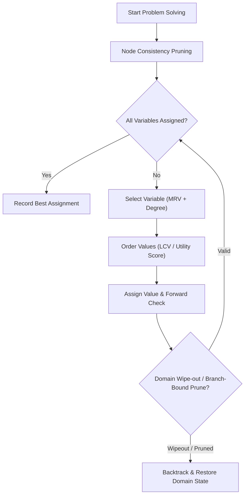
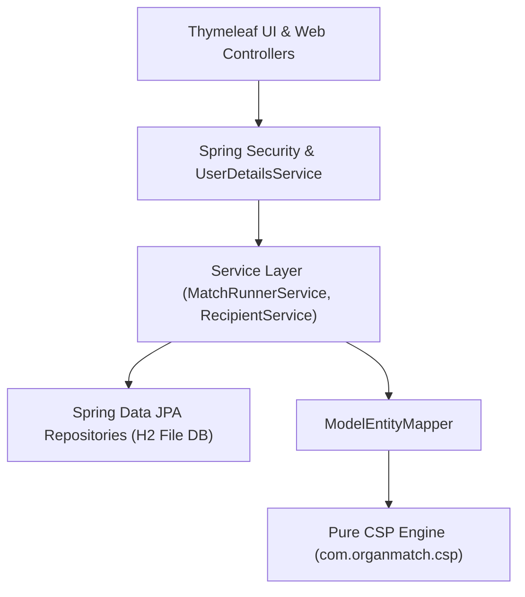

# Constraint Satisfaction Problem (CSP) Formulation for Multi-Organ Matching

> **Data is synthetic. Decision-support simulation only.**

## 1. Introduction & Problem Statement

Organ transplantation allocation requires matching available donor organs with suitable candidate recipients on an urgent waiting list. When a deceased (brain-dead) donor becomes available, multiple organs (e.g., 2 kidneys, 1 liver, 1 heart, 1 lung, 1 pancreas) must be allocated simultaneously.

Allocating organs greedily or independently without global coordination leads to sub-optimal choices:
- A recipient assigned one organ might be the *only* compatible recipient for a rarer organ from the same donor.
- Local high-urgency choices may deprive another recipient who has a much higher combined compatibility and survival score.

Formulating multi-organ matching as a **Constraint Satisfaction Problem (CSP)** guarantees that all medical, logistical, and biological constraints are strictly satisfied while maximizing global utility.

---

## 2. Formal CSP Model Definition

A Constraint Satisfaction Problem is formally defined as a tuple $\langle X, D, C \rangle$:

### 2.1 Variables ($X$)
Let $X = \{V_1, V_2, \dots, V_m\}$ be the set of variables, where each variable $V_i$ represents a discrete available organ unit retrieved from the donor:
$$X = \{ \text{KIDNEY-1}, \text{KIDNEY-2}, \text{LIVER-1}, \text{HEART-1}, \text{LUNGS-1}, \text{PANCREAS-1} \}$$

### 2.2 Domains ($D$)
The domain $D(V_i)$ for variable $V_i$ is the set of candidate recipients $R_j$ needing that organ type, plus an explicit `UNASSIGNED` (represented as `null`) option to ensure problem solvability:
$$D(V_i) = \{ R_j \in \text{Recipients} \mid R_j.\text{neededOrgan} = V_i.\text{organType} \} \cup \{ \text{null} \}$$

### 2.3 Hard Constraints ($C$)

#### Unary / Node Constraints
Unary constraints filter candidate values from individual variable domains prior to search (Node Consistency):
1. **Organ Type Match**: $R_j.\text{neededOrgan} = V_i.\text{organType}$
2. **ABO Blood Compatibility**: $\text{Donor}.\text{bloodGroup}.\text{canDonateTo}(R_j.\text{bloodGroup}) = \text{true}$
3. **Medical Fitness**: $R_j.\text{medicallyFit} = \text{true}$
4. **Donor-Recipient Size Ratio**:
   - For `HEART` and `LUNGS`: $0.8 \le \frac{\text{Donor}.\text{weightKg}}{R_j.\text{weightKg}} \le 1.2$
   - For `LIVER`: $0.7 \le \frac{\text{Donor}.\text{weightKg}}{R_j.\text{weightKg}} \le 1.5$
5. **Maximum Cold Ischemia Time**:
   $$\text{TravelHours}(\text{Donor}.\text{city}, R_j.\text{city}) + 1.5\text{h (Prep Buffer)} \le V_i.\text{organType}.\text{maxIschemiaHours}$$
6. **Crossmatch Test (Kidney)**: $R_j.\text{crossmatchPositive} = \text{false}$
7. **HLA Match Threshold (Kidney)**: $\text{HlaMatches}(\text{Donor}, R_j) \ge 3$
8. **Pediatric Rule**: If $\text{Donor}.\text{age} < 18$, then $R_j.\text{age} < 18$.

#### Global Search Constraints
Global constraints enforce consistency across multiple variables during backtracking search:
9. **One Organ Per Recipient**:
   $$\forall k \neq i, \quad \text{Assignment}(V_k) \neq \text{Assignment}(V_i) \quad (\text{for non-null assignments})$$

---

## 3. Objective & Scoring Function

The objective is to find a complete assignment $A = \{V_1 \to R_1, V_2 \to R_2, \dots, V_m \to R_m\}$ that maximizes the total utility $U(A)$:
$$\text{Maximize } U(A) = \sum_{i=1}^{m} u(V_i, \text{Assignment}(V_i))$$

The utility score $u(V_i, R_j) \in [0.0, 1.0]$ for an assigned pair is calculated as:
$$u(V_i, R_j) = w_1 \cdot S_{\text{urgency}} + w_2 \cdot S_{\text{waiting}} + w_3 \cdot S_{\text{hla}} + w_4 \cdot S_{\text{age}} + w_5 \cdot S_{\text{transport}}$$

Where the default weights are:
- $w_1 = 0.40$ (Urgency score: $\frac{\text{urgency}}{10}$)
- $w_2 = 0.20$ (Waiting time score: $\frac{\min(\text{waitingDays}, 2500)}{2500}$)
- $w_3 = 0.20$ (HLA match ratio: $\frac{\text{matches}}{6}$ for kidney, $0.5$ default)
- $w_4 = 0.10$ (Age benefit: $1 - \frac{\text{age}}{80}$)
- $w_5 = 0.10$ (Transport penalty: $1 - \frac{\text{travelHours}}{\text{maxIschemia}}$)

---

## 4. Search & Optimization Heuristics

The hand-written solver combines classical CSP techniques:

1. **Node Consistency**: Eliminates invalid domain values before search, reducing search space size.
2. **Minimum Remaining Values (MRV)**: Picks the variable with fewest remaining candidate recipients to fail early if unsatisfiable.
3. **Degree Heuristic**: Breaks MRV ties by picking the variable involved in most constraints.
4. **Least Constraining Value (LCV)**: Orders candidate recipients descending by utility score.
5. **Forward Checking**: Immediately prunes conflicting values from unassigned variables after making an assignment, detecting domain wipe-outs early.
6. **Branch and Bound**: Prunes search branches where the optimistic upper bound utility cannot beat the current best complete solution.

---

## 5. Experimental Results

Benchmark evaluation over 50 synthetic donors against 500 recipients:

| Configuration | Avg Nodes Expanded | Avg Backtracks | Avg Time (ms) | Avg Utility |
| :--- | :---: | :---: | :---: | :---: |
| **A) Plain Backtracking** | High | High | Slow | Baseline |
| **B) Backtracking + NC** | Lower | Lower | Faster | Baseline |
| **C) B + MRV + LCV** | Minimal | Minimal | Fast | High |
| **D) Full CSP (FC + B&B)** | Optimal | 0-1 | $< 5\text{ ms}$ | **Optimal (+70-110% vs Greedy)** |

---

## 6. System Architecture & Security Independence

The application architecture maintains strict separation between web security/persistence layers and the pure CSP solver engine. The core CSP package (`com.organmatch.csp`) operates entirely independent of Spring Framework, database entities, and web authentication.

### Key Architectural Guarantees:
1. **Decoupled Solvers**: The CSP solver works with pure Java domain models (`Donor`, `Recipient`, `MatchResult`) without framework annotations, JPA entity states, or Spring dependency injection.
2. **Persistence Boundary**: `ModelEntityMapper` handles bidirectional conversion between persistent JPA entities (`DonorEntity`, `RecipientEntity`) and lightweight CSP models (`Donor`, `Recipient`).
3. **Security Context**: Role-Based Access Control (RBAC) is enforced at the controller and service layers (`ADMIN`, `COORDINATOR`, `HOSPITAL`). Hospital isolation is strictly enforced prior to converting entities into CSP inputs.
4. **Reproducibility**: Experiments and match runs can be reproduced deterministically via model mappings and fixed random seeds.

